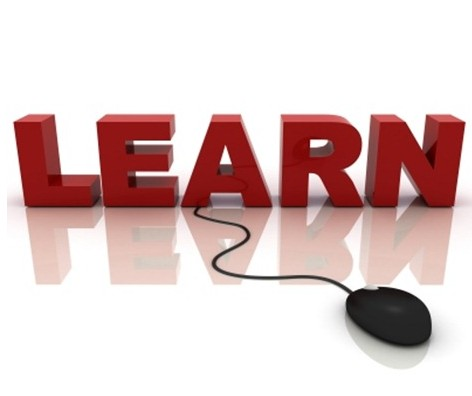
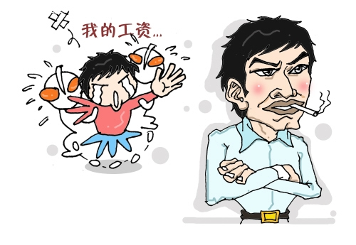
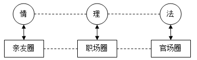
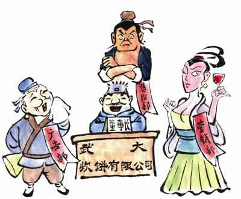

% 文章集锦
% 张昆伦
% 2015年09月02日 更新

# 从技术专家到项目经理之【学习是一种能力】

<h1 class="show">从技术专家到项目经理之</h1>
<h2 class="subtitle">学习是一种能力</h2>

学习是一种基础性的能力。然而，“吾生也有涯，而知也无涯。”，如果学习不注意方法，则会“以有涯随无涯，殆矣”。

## 一．学习也是一种能力

看到这个标题，有人会说：“学习，谁不会？”的确，学习就像吃饭睡觉一样，是人的一种本能，人人都有学习的能力。我们在刚出生的时候，什么也不知道，是一张真正的白纸，我们靠学习的本能，学会了走路、说话、穿衣服…后来，我们上学了，老师把书本上的知识一点一点灌输到我们的脑子里，我们掌握的知识越来越多，与此同时，我们学习能力却好像越来越差了，习惯了被别人喂饱，似乎忘记了怎么来喂自己了。

学习本来只是一种本能，算不上什么能力，然而，经过二十多年的不断学习，学习反而成为了一种真正的能力，因为我们慢慢失去了它，它就更显得珍贵。

在学校里我们基本上被动式学习，然而走出了象牙塔之后，不会再有人对你负责，不会有人主动教你，我们需要主动的学习。所谓的学习能力，其实就是自主学习的能力。

几年前，曾有一本风靡管理界的书，叫《第五项修炼》，这本书倡导建立学习型组织，因为从长远来看，一个组织唯一可持续的竞争优秀，就是比竞争对手更快更好的学习能力。

一个公司如此，一个人又何尝不是如此？众所周知现在是一个知识爆炸的时候代，知识更新非常快。据说，一个大学毕业生所学习到的知识，在毕业之后的2年内，有效的不过剩下5%，更何况我们的学校与社会需要严重脱轨。我们赖以立足的，不在于我们现在掌握了多少知识，而是我们有多强的学习能力！

学习不但是一种能力，而且是一种至关重要的能力，而这种能力的核心，就是学习的方法和心态。

 

## 二．买书是最划算的投资

古人云：“书中自有黄金屋，书中自有颜如玉。”这说明先贤们早就认识到，买书是最划算的投资了。

当我刚出道的时候，拿着非常微薄的工资，有一次我向主管抱怨道：“现在的书真贵啊，这点工资连饭都吃不起，更别说买书了！”主管对我说：“不要吝惜买书的钱，宁可忍着不吃饭，也不要忍着不买书，因为买书是回报率的最高的投资了。”

主管的话让我非常震动。后来，我看到喜欢的书时，再有没有手软过。我不断的学习，开发能力也不断的提高，工资水平也获得了大幅度的提高。一年后，我一个月工资的涨幅，就足够买两年的书了。你说，还有比这更划算的投资吗?

一本书，哪怕只有一页纸是有用的，它将所产生的潜在价值，也会远远超过书本身的价格。当然，书不在多，能踏踏实实消化掉一本好书，可能比泛泛而读10本普通书，要更有价值得多。

 
## 三．多读经典书

十年前，我刚开始工作的时候，真是求知渴，每星期都要往购书中心跑，可惜的是，那时给我看的书不像现在这么多，高质量的书就更少了。

回首往昔，令我比较郁闷的一件事就是在我最有学习动力的时候，看的高质量的书籍太少，就好像是在长身体的时候，天天吃的是没营养的泡面。当然，这跟没有人指导也有很大的关系，独自一个人学习，让我走了很多的弯路。

如果一本经典书你看得很辛苦，很有可能就是因为你功力未够，这种情况下不要着急，慢点来，不妨先将其先束之高阁，多看看第二类实战型书籍，过一段时间再回头来看，也许你会有新的惊喜。

 

## 四．不要在上班时间看书

一个善于学习的人，首先要善于利用一切时间来学习。不知是伟大的雷锋叔叔还是鲁迅爷爷曾经说过：“时间就像海绵里的水，只要愿挤，总还是有的。”然而，当我们从上班时间中挤时间学习时，就千万要注意了，不要在上班时间看书！

上班时间看书不但是一件很敏感的事情，而且非常吸引眼球，很快就会引起周遭的不爽。首先老板心里不爽，他想：“我给你钱是让你来工作的，不是来学习的！”；其次同事们也不爽：“我们工作都做不完，瞧，这小子真闲哪！”用不了多久，你就会成为被众人排斥的异类。

 当然，你可能会说，“我工作已经做完了，经理没有安排，当然可以学习了”，其实不然。你完成了一件事情，不等于所有的事情都完成了。一个优秀的员工，应该是主动要工作，而不是被动的等工作。工作完成以后，你至少还可以：

（1）主动汇报给你的经理，请他来检查你的成果，并安排新的任务；

（2）如果公司这一段时间确实比较闲，没有什么具体的任务，可以进行代码重构、优化；

（3）你还可以主动请缨，承担额外的工作或更艰巨的任务。

（4）如果一定要学习，也只能对着电脑屏幕来学习，纸质书最多只能拿来翻阅一下，而不能一直捧着，以免影响到其他人的情绪。

 

## 五、看书要找准方向、一段时间只选一个主题

学习最忌三心二意。俗话说：“伤其十指不如断其一指”，一段时间专心学好一个方向。这个道理谁都懂，可是又该学哪个方向呢？难道只能跟着感觉走吗？

不！最实际的方向，应该跟着工作走，工作需要什么，我们就学什么，把工作需要的技能熟练掌握。我们为什么要学习和工作弱相关的东西呢？是为了转行或跳槽吗？可是，如果我们连现在本职工作都不能做好，又怎么能保证到新的岗位、用新学的技能就可以做得更好呢？

学习与工作需要的的东西，有很多好处：

首先，可以集中精力，在某一方面钻研得更加深入。所谓“百招会不如一招绝”，有了绝招，你还怕不能在“武林”立足吗？《天龙八部》中的慕容复武功博学无比，最后还不是被只会一招六脉神剑的段誉打得落花流水？

其次，可以学得更快、更深入，因为学习更具有针对性，而且可以立即在工作中运用，可以马上检验出学习的效果，对存在的问题可以进行深入的研究，因此掌握的知识也会更加的牢固。

第三，学习与工作结合在一起，工作时间也就成了学习时间，这样突破了三个8小时的限制。有人说，我们每天所有拥有的时间可以分为三个8小时，工作8小时，睡觉8小时，另外还有8小时自己可以自由支配的时间。工作和睡觉的两个8小时大家都一样，决定人生高度的是另外这个8小时。当我们把学习的焦点放到与工作相关的知识上时，工作时间中的很大一部分，同时也就成了宝贵的学习时间，这真是一举两得的美事啊。

 

## 六．织网式的学习

知识的广度和深度都很重要。作为一个程序员，深入把握技术细节，是写出优质代码的保证。但对于一个项目经理而言，知识的广度更显重要。项目中碰到的问题往往是综合性的，只有具有广博的知识，才能快速的对问题进行分析和定位。在程序员通往项目经理的道路上，我们必须有意识的扩大自己的知识面，形成更完善的知识体系。

每个人的知识体系就好比是一张网，我们学习其实就是要织这样一张网。 我曾看过渔网的编织过程，渔网虽大，也是一个结点起步，一个点一个点的编出来的，编织的过程中，始终只有一根主线。

学习又何尝不是这样，知识体系的大网也是由许多小的结点组成，要结这样一张网，只能由一个点起步。牵住一条主线，织出一个个的点，由点带出面，最后才能形成这张大网。

 

## 七．问题是最好的学习机会

日本经营之神松下幸之助曾经说过：“工作就是不断发现问题、分析问题、最终解决问题的一个过程，晋升之门将永远为那些随时解决问题的人敞开着。”可见，工作过程中有问题是正常，没有问题那才是真正的问题。在发生问题时，能勇于面对问题、解决问题的人，才是公司真正的核心骨干。

现实中，很多人总是千方百计回避问题，当上司安排一项艰巨的任务时，也是想尽办法推托。殊不知，对于个人而言，其实问题是最好的学习机会。往往那些愿意接受困难工作的人，能力会变得越来越强，那就是因为他们在克服困难的过程中取得了巨大的进步。 

有一次，一位项目经理对我说：“有一个问题，客户有一台HP服务器要装磁盘阵列，没人会做，怎么办啊？”

“可以学啊，没有人愿意去吗？”

“我都问了，没人想去。”

“哦，正好明天我有时间，我也没装过磁盘阵列，那我明天去学着弄一下。”我说的是真心话。

第二天早上，当我准备出发时，项目经理告诉我不用我去了，因为项目组好几个同事都想去“学着弄一下”。

结果服务器很快就装好了，远远没有之前大家想像的那么困难嘛。更重要的是，在解决这个问题的过程中，大家都学会了怎么装磁盘阵列。

碰到困难时，迎难而上吧，千万不要拒绝这个最好的学习机会！

 

## 八．经常思考总结

子曰：“学而不思则罔”。只学习不思考，就会迷惑，难以把握事情的本质。这就好比一个学武之人，只习得其形，而未得其神，难以成为真正的高手。

一个程序员从入门，到成为高手的过程中，往往要经过几次顿悟。顿悟会让你跳出知识的丛林，一切豁然开朗，仿佛打通了全身的奇经八脉一般奇妙。记得我有一次，顿悟到了一个很简单的结论：“原来高级编程语言中的类库是封装了Windows API来实现的。”后来碰到一些自带类库无法实现的功能时，我就会想到，其实可以通过调用Windows API来实现。利用这个思路，我解决了一些看起来很难的问题，得到老板的赏识，从而很快获得提升。

顿悟非常可贵，然而它不是随便发生的，而是经过一次次苦苦思索之后、灵光闪现的结果。思考的过程，其实就是将外在的知识内化为自己的知识的过程，而顿悟，则是批量的实现这种内化，将无数个知识点连接在一起，达到融会贯通的境界。

 

## 九、克服“高原现象”

爱学习的人都会有这样的经历，学习持续了一段时间之后，往往会有一个瓶颈期，长时间似乎很久没有什么进步，于是内心非常着急。

这种情况实际上这是由人的学习规律决定的一种“高原现象”。据研究，学习者在刚开始进步快，随后有一个明显的或长或短的进步停顿期，后期进步慢，中间的停顿期叫高原期。

在我看来，高原期实质是一个消化期，由于前期的学习积累了太多的知识点，这些知识点在大脑中乱作一团，还没有形成一个知识体系。这时需要一定的时间来消化它，将它融会贯通，经常思考总结可以快速帮你跨过高原期。

在处于高原期的时候，还可以换一个相关的方向来学习，例如编程语言学不下去了，你可以学习一下设计模式，设计模式也学不下去了，再换成数据库。通过学习这些相关的知识，不但补齐了知识体系中的短板，而且各个知识点之间可以互相启发，帮助你实现顿悟，跨过高原期。

 

## 十、学习要有好心态

### （1）学习要静心

急于求成是学习过程中普遍存在的一种心态。这可以理解，毕竟作为一个程序员，要学的东西实在太多了，而社会又是那样的浮躁，让人觉得一切都是那样的不安全、不确定，似乎只有学得快一点，才能跟上社会的脚步。

可是“欲速则不达”，想快快的学，往往会形成东一榔头、西一棒槌的学习方式，每一个点都没有吃透。心沉不下去，知识也会沉不下去。要想成为真正的高手，只能静下心来，一步一个脚印的攀登。

### （2）学习是一个持续一生的过程

人生的过程，就是一个自我完善过程。

孔子曾经说：“吾十有五而志于学，三十而立，四十而不惑，五十而知天命，六十而耳顺，七十而从心所欲，不逾矩。”可见孔子也不是天生的圣人，也在不停的学习、进步，从“志于学”到最后“从心所欲，不逾矩”，孔子一共花了55年的时间。

作为一个程序员，更是需要不断更新自己的知识。我们所知道的东西，就像一个白色的圆圈，圈外则是黑暗的未知的世界。当圆圈越大，所接触到的黑暗部分就越多。我们只有不停的学习，打破更多的黑暗，找到更多光明。

### （3）保持饥饿，保持愚蠢

看了《乔布斯传》之后，我最喜欢的一句话是“求知若饥，虚心若愚”（Stay Hungry,Stay Foolish），其实我更喜欢它更原生态的翻译“保持饥饿，保持愚蠢”。我们只有认识到自己还很饥饿和愚蠢，才会像没吃饱一样，由衷的需要学习、爱上学习。

 当然，知易行难，知行合一才是学习的最高境界。我也始终是一个学习者，一直在路上。

## 十一、我推荐的学习书单

人人都说过的项目经理知识是一个复杂而博大且没有专门教材的学科，所以花了点时间，按项目经理所需的能力，分别推荐几本不错的书，你可以根据自己在哪些方面缺乏或需要用到，挑着读一读。

* 一、项目管理
	1. 《项目管理知识体系指南》
	2. 《做项目，就得这么干——你也可以成为卓越的项目管理者》
	3. 《人月神话》
	4. 《敏捷估计与规划》

* 二、需求分析
	1. 《淘宝十年产品事》
	2. 《启示录：打造用户喜爱的产品》
	3. 《探索需求》
	4. 《需求：缔造伟大商业传奇的根本力量》

* 三、产品运营
	1. 《从零开始做运营》
	2. 《微博：改变一切》
	3. 《别说你懂微信营销》
	4. 《玩法变了:淘宝卖家运赢弱品牌时代》

* 四、心理学
	1. 《组织行为学》
	2. 《消费者行为学》
	3. 《设计心理学》
	4. 《怪诞心理学》
	5. 《影响力》

* 五、时间管理
	1. 《高效能人士的七个习惯》
	2. 《番茄工作法图解》
	3. 《搞定：无压工作的艺术》
	4. 《把时间当作朋友》

* 六、逻辑思考
	1. 《纳什均衡与博弈论》
	2. 《简单逻辑学：改变思维方式第一书》
	3. 《批判性思维：带你走出思维的误区》
	4. 《思考，快与慢》
	5. 《学会提问：批判性思维指南》

* 七、创新
	1. 《TRIZ理论全接触》
	2. 《这也能想到？巧妙解答无厘头问题》
	3. 《打开餐巾纸(〈餐巾纸的背面〉之实用手册)》
	4. 《别做正常的傻瓜》
	5. 《idea+打开设计师的创意百宝箱》

* 八、沟通协调
	1. 《非暴力沟通》
	2. 《高难度谈话》
	3. 《卡内基沟通与人际关系》
	4. 《人性的弱点》
	5. 《身份的焦虑》

* 九、市场营销
	1. 《免费:商业的未来》
	2. 《商业模式新生代》
	3. 《众包：大众力量缘何推动商业未来》
	4. 《龙卷风暴》
	5. 《跨越鸿沟》

* 十、产品设计
	1. 《简约至上：交互式设计四策略》
	2. 《用户体验要素:以用户为中心的产品设计》
	3. 《点石成金：访客至上的网页设计秘笈》
	4. 《在你身边，为你设计：腾讯的用户体验设计之道》
	5. 《写给大家看的设计书》
	6. 《About Face3交互设计精髓》

* 十一、数据分析
	1. 《统计数字会说谎》
	2. 《巴菲特教你分析财报》
	3. 《谁说菜鸟不会数据分析》
	4. 《深入浅出数据分析》

* 十二、工具运用
	1. 《PPT炼成记》
	2. 《Excel图表之道：如何制作专业有效的商务图表》
	3. 《Word排版艺术》
	4. 《UML精粹:标准对象建模语言简明指南》
	5. 《Axure RP 6原型设计精髓》

* 十三、技术知识 
	1. 《计算机科学概论》
	2. 《数学之美》
	3. 《推荐系统实践》
	4. 《淘宝技术这十年》
	5. 《构建之法》

# 从技术专家到项目经理之【伤不起的30岁】 

<h1 class="show">从技术专家到项目经理之</h1>
<h2 class="subtitle">伤不起的30岁</h2>

技术专家干到30岁，好不容易从码奴混到了白领，却再也干不动了，还时时面临失业的危险。30岁，是一个程序员伤不起的年龄。明天，何去何从？

## 一．30岁现象

在官场上，曾经有一个59岁现象，就是官员们会在59岁时，会使劲捞上一把。很明显嘛，权力过期作废，再不捞就要退休了，没有机会了。

在程序员的圈子里，也有一个30岁现象。当然，如果你有铁饭碗，比如在国企或政府机关，那你是无法理解底层劳动人民的感受的。同时也要恭喜你成为体制内的一员，可以一直干到退休无忧。

30岁现象人人都明白，但要给出一个定义并不容易。列举几个表现，也许你会觉得心有戚戚焉。

面临职业瓶颈，程序写不动，上升又困难。

薪水较高，加班变少，后浪追前浪，面临失业压力；

生活压力剧增，不敢跳槽；

招聘程序员年龄限制在30岁以下成为行业潜规则，跳槽困难。

30岁现象和59岁现象貌似不搭边，其实都出于同样的原因：价值贬值。官员老爷在任就像皇帝，一旦退休，就成为了平民百姓，贬值那是自然的。而程序员也一样，所谓三十而立，一旦到了30岁左右，由于面临结婚生子，一方面需要高薪抚养家庭，另一方面却无法像以前那样全身心投入到工作，性价比急剧下降；与此同时，大批廉价的新手涌入，他们往往还使用最新的技术，老一辈程序员只能慢慢的靠边站了。

 

## 二．不可替代性

30岁现象产生，只能程序员自身身上找原因。

当然我们也可以产业、从社会、从政府、从制度等多方面进行分析，发现不足，这些分析未必没有道理，但是肯定没有用，因为我们无法改变。所谓“命苦不能怪政府，命背不能怪社会”，从外部找原因，只会让我们满腹牢骚，整天觉得自己生不逢时，苦闷不堪。

从自身找原因，试着问自己几个问题：“为什么我的性价比以下降？老板为什么要请我，给我高工资呢？一个人有价值是由什么决定的呢？”

你也许可以列出很长很长的答案，但我想应该都可以浓缩为一句话：“一个的价值是由他的不可替代性决定的”。不可替代性可以理解为，为了替代你老板需要付出的代价。

因为你的可替代性高，所以性价比下降。反之，因为你不可替代性高，所以老板会给你开高工资。不是这样的吗？

有一则小故事：

技师退休时告诫自己的徒弟：“少说话，多做事。” 

十年后徒弟也成了技师，他找到师傅，苦着脸说：“师傅，我一直都按您的教导做，只知埋头苦干，可那些比我技术差的都升职了、加薪了，我还是拿着过去的工资。” 

师傅想了想，说：“你请一次假吧。如果一盏灯一直亮着，那就没人会注意到它……”

徒弟恍然大悟，真的请了一星期假，等他回去上班时，厂长找到他说要给他加薪。原来，在他请假时，厂长发现，工厂已经离不开他了。

徒弟很高兴，以后他时不时就请几天假，每次请假后厂长都会给他加薪。一天徒弟请假后准备去上班，厂长却告诉他：“你不用来上班了。” 

 

徒弟苦恼地去找师傅，师傅说：“那天我的话还没说完呢。一盏灯偶尔可以熄灭一次，可如果它总是熄灭，性质就不一样了，因为没人会需要一盏时亮时熄的灯。”

 故事中，因为徒弟的不可替代，所以厂长给他加薪；后来因为有其它的灯亮了，他被替代了，厂长不需要他了，所以被炒了鱿鱼。

所以我们归根到底还是要提高自己的不可替代性。否则，一旦老板觉得用较低的代价就可以替代你，那么你就面临可能失业的危险了。

 

## 三．出路在哪里

那程序员到了30岁，怎样提高自己的不可替代性呢？我们打算做一辈子程序员吗？敢问路在何方？

作为一个过来人、一个资深程序员，我觉得有几个方向可以选择：

### （1）成为技术大拿

其实，做一辈子程序员并没有什么问题，重要的是，你必须成为一个不可替代的程序员，也就是说，你要成为技术大拿，能够解决普通程序员所不能解决的问题。技术大拿有两个版本：

一是程序员加强版。你仍然是一个程序员，但你是一个很牛的程序员，凭借多年的积累，你在知识广度和深度方面均已不是等闲之辈。从汇编到java，你样样精通。你在意数据结构和算法，对系统的优化有独到见解，对设计模式如数家珍，你还有完备的工具箱和自己的专用类库。其实，加强版程序员有非常独特的价值，可惜的是，在现实中却很少见，因为对任何一个公司而言，人才总是很稀缺的。老板的眼睛是雪亮的，他怎么会对你这种技术大牛视而不见呢，在你还没有成为真正的大拿之前，早已经被任命为系统架构师、项目经理或者更高的职位了。因此，你想守住自己的一亩三分地，悠闲的做自己的大拿，往往是不可能的。

二是程序员升级版。虽然你的内在仍然是一个程序员，但你的职位已经升级了，你成为了系统分析师或系统架构师。这是非常自然和现实的选择。程序员与系统分析师或架构师之间并有鸿沟，只需一步而已，你就可以从崎岖山路驶向宽阔的大马路。但这一步却并不容易，需要几年时间不断思考、学习、实践，才能化蛹成蝶。

### （2）成为行业专家

行业专家也是一个公司不可缺少的角色，他们对公司的行业知识、业务流程和细节了如指掌。行业专家一般并不是从外部招聘的一个只懂业务、不懂技术的超人，而往往是从程序员经过多年的摸爬滚打成长起来的。作为从程序员成长起来的行业专家，你往往还肩负系统分析师之职。在公司里，对业务有一般了解的人很多， 但专家级别的往往很少，为了后30年的职业生涯，你必须成为专家。

### （3）朝管理方向发展

向管理方向发展的第一步，一般是被任命为项目经理。在大部分IT公司里， 项目经理是最小的管理岗位了，可能你不会觉得有太多惊喜，工资也没有大的提升，但这个转变，可以说会成为你一生中最重要的转变之一。

不要小看了项目经理。有人说，项目经理是一个古老的职业。也人有人说，21世纪是项目管理的世纪。事实上，从人类有组织以来，就一直有项目管理，以前的项目经理可能是部落首领，一次集体打猎、一次攻城拔寨，都可以视为一个项目。项目管理的知识可以应用到我们生活的方方面面，大至登月计划的实施，小至家庭聚会的组织，都离不开项目管理。

一个优秀的项目经理，不仅需要高智商，还需要高情商。可以不夸张的说，如果你能胜任项目管理，你就可以胜任战术层的所有管理岗位，甚至你有家庭生活质量，也会提高到新层次。

然而，要成为一名优秀的项目经理，并不是一件容易的事情。可以说，需要一定的天分，有些人无师自通，有些人却永远也学不会。程序员属于高智商人群，情商却往往存在不足，这注定了只有少数程序员能够成长为项目经理，成为优秀的项目经理，则非常稀少了。

如果你觉得这几方面都不合适，那你还有几条出路：

**一是塌塌实实混日子。**

说老实话，做老实人，办老实事，拿老实的工资，这种员工公司也是非常需要的，一般不会遭遇炒鱿鱼的命运；

**二是转行或者创业。**

因为这个行业已经不再适合你，已经没有更大的发展前途，只能转行。如果可以转行，未必是坏事，也许在新的环境中，可以激发出更强的能量，创造出一番事业来。至于创业，那就更具有挑战性了，建议你在创业之前，已经成为了一名优秀的项目经理。试想，如果转不动一个项目，如何能转动一个公司？

# 从技术专家到项目经理之【不要试图和下属做朋友】

<h1 class="show">从技术专家到项目经理之</h1>
<h2 class="subtitle">不要试图和下属做朋友</h2>

在项目团队经常有一些比较能干的员工，为项目经理排忧解难，因此渐渐得到项目经理器重。由于互相依赖，两者很容易发展成为朋友关系，有的项目经理甚至将员工当作“心腹”看待，借此来笼络员工，这其实是一种很不明智的做法。

从广义上来说，同事也是朋友，同事之间也是存在友情的。在正常情况下，项目经理与每个人的距离是相等的，整个团队保持一种平衡。如果项目经理与某位员工建立了过于亲密的朋友关系，这种平衡将会被打破，从而影响整个团队的凝聚力。

## 一、得不偿失的朋友关系

表面看上去，工作与朋友并不矛盾。人非草木，孰能无情？长期工作，在同事之间产生友谊，这是可以理解的，而且也有助于建设凝胶型团队。但对于一个管理者而言，如果表现出与下属有亲密的朋友关系，那就实在不妥了。在项目中，朋友关系不但会大大折损项目经理的威信，而且对整个项目团队还会产生许多其它负面的影响。

### （1） 无法客观公正

一旦下属成为朋友，项目经理在工作就难以像以前一样做到公正客观。毕竟在公司工作主要是讲原则，而朋友之间则要讲感情，如果朋友这间处处以真理为依据，以大是大非为准则，这样的朋友估计是做不长的。同样如果工作中带进过多的感情色彩，工作也会变得难以开展。

我们不妨设想一下，和员工成为朋友这后，碰到下面这些情况你会如何处理：

* 朋友在公开场合发表不恰当的言论，或者打乱项目内的等级秩序和工作流程，你会像批评其他人一样直接批评他吗？还是用对方可能听不懂的话进行暗示提醒？

* 在对员工进行绩效考核时，你会不会因为感情原因，不自觉的拔高一些他的分数呢？

* 在其任务不能保质保量、按时完成时，你的要求是不是也降低或更富有弹性了？

* 你是不是不能像以前那样自然的来检查他的工作了？

* 在检查他的工作时，发现了技术问题，你是不是也不好意思进行指导了？

* 在他变得自以为是、经常对你提一些不切实际的建议和要求时，你是不是也无可奈何了？

一边是原则，一边是友情，该如何抉择？这就是把朋友关系带进工作后，项目经理面临的困境。面对上面的这些问题，项目经理要想持守中道，就必须摒弃感情的因素，以原则为导向，以事实为依据，做出冷静的选择。这样，不管将来项目中会出现什么问题，项目经理都可以做到问心无愧，进退有据。

###（2） 给所有成员带来错觉和困扰

工作中的朋友关系不只是给双方带来不便，而且会给其他员工带来错觉和困扰，从而影响项目的凝聚力和战斗力。

在IBM日本总部曾发生过一个著名的“东京事件”：

IBM “东京事件”的起因，是IBM东京公司高层决定秘密重奖几位工作出色的骨干分子。这件事本来是机密，在美国IBM本部也是一种例行的激励手段，但让管理层意想不到的是，领奖的几个人刚走不久，一些没有得到奖励的人就跑来要求辞职。他们这么做倒不是出于闹情绪，原因很简单——别人被重奖，而自己没有得到奖励，证明自己工作成绩不突出，得不到领导认可，继续“混”下去没劲，还不如自己知趣点，主动申请走人，免得日后被老板裁掉那么尴尬。令管理层更想不到的是，等这些人刚走，那些受到奖励的人又跑来要求辞职！原因更简单——由于自己被老板重奖的原因，害得同事们丢了饭碗；而同事因此辞职又害得公司工作陷入了被动。所以是既对不起同事也对不起公司，只好坚决辞职，以谢同事和公司。

这个事件看起来很诡异，对骨干员工的奖励居然会导致所有员工辞职，但这件事同时也是可以理解的，因为对个别的秘密奖励破坏了员工之间原有的平衡关系。这件事也让我对日本人的团队精神刮目相看，我想这也是我们该好好学习的地方。

虽然故事中是对部分员工进行物质奖励，与我们谈的朋友关系似乎没有什么联系。但两者对团队和谐的破坏是相同的，我们完全可以进行类比。项目经理和下属的朋友关系，在一定程度上，就好比是对个别员工的特殊奖励。其他员工会想，“既然经理跟他这么亲近，对我们这么疏远，想必我们没有什么价值”，这样团队的士气必然大打折扣。项目经理的同事朋友回头一想，也许会觉得“经理对我一个人这么好，肯定会引起其他人的不满，我还是离经理远一点才好”。这样一来，整个团队都会陷入不必要的困扰中。

一个和谐团队内部，员工之间会保持一种微妙的平衡，它源自项目组成员之间彼此平等、互相尊重的关系，以及相互之间的乐于接受的评价和看法。一旦组织内部出现某种特殊关系，这种平衡就会遭到破坏。

在项目中如果项目经理与个别员工建立亲密的朋友关系，这对其他人的思想观念会产生很大的冲击，搞不好就会其他人“三观尽毁”：

* 对自己的看法

他们会想，是不是经理认为我能力差？我在团队是不是不重要？在考核或分配奖金时项目经理会不会也厚此薄彼？在被批评时，会想经理是不是有意对我刻薄？不行，看来没有前途，要走人了！

* 对项目经理“朋友”的看法

那个家伙编程不怎么样嘛，有问题还不是问我？只会花言巧语，博得经理高兴。

* 对项目经理看法

这个项目经理不怎么样，没有威信，喜欢听好话，跟着他干没前途。

也许那个下属确实能力超群，也许项目经理能够尽力把握公正与平衡，但这些不足以挽回项目经理因表面上“偏心”给团队带来在伤害。

 

## 二、正确认识员工与公司的关系

为什么项目经理难做？一个重要原因，就是项目经理具有双重身份。当面对员工和客户，他代表公司；面对老板，他又代表员工。因此项目经理经常需要处理公司与个人之间的一些问题，一个经验丰富的项目经理，也必然更加懂得公司与员工之间的关系。

很多公司为了提高凝聚力，宣称 “员工是主人翁”、“公司是大家庭”等等，这得到无数人的认可。既然公司是家庭，那员工也就是家庭成员了，这样看起来员工与公司的关系应该非常亲密，员工之间也应该如同兄弟姐妹一般才对，那项目经理与员工怎么连朋友都做不得了呢？

写到这里，不由得想起了在2004年联想公司的裁员风暴中，曾有一篇流传广泛的文章叫《公司不是家》。作者目睹了曾经一起为梦想奋斗、以联想为家的同事，几天之内一批批被遣散。被裁的员工事先都完全不知情，在面谈之前，他们的一切手续公司都已经办完，邮箱、人力地图、IC卡全部被注销，当他们知道消息以后，两个小时之内必须离开公司。

作者在文中伤感的写道：“我突然想起来二战时某位著名将军说的话：“我让士兵上战场的时候，我会把他们想象成一堆蚂蚁，而不是人。因为我一想到他们有妻子、孩子、父母，我就不忍心让他们去送死。”不知道领导在讨论名单的时候，是把我们想象成蚂蚁吗？……我想，我比许多人都体会深刻。员工和公司的关系，就是利益关系，千万不要把公司当成家。”

联想董事长柳传志也对这篇文章做出了回应，他说：“我很抱歉地对《公司不是家》的作者说，我们考虑问题的角度不同。元庆只能从企业发展的角度，从大局的角度看问题，这才是最根本的以人为本，最根本的为员工负责。如果元庆真的用为局部员工负责的方法去考虑问题，企业就会陷入一片儿女情长之中，完全无法发展，中国就会失去联想。因此企业前进的主旋律只能是战鼓，是激昂。”

大裁员是一件很惨烈的事情，但这不能怪公司，它的生存法则决定了它只能这么做。

通过联想这位员工与老板的对话，其实已经清楚的把员工与公司的关系说出来了，其实公司根本不是什么家，只是工作的地方而已，公司出钱请员工干活，就这么简单。柳传志说裁员是为了更好的以人为本，如果公司是家的话，那这就好比家长对孩子说：“为了让全家人都有饭吃，我只好把你仍掉了”，岂不荒谬？所以那些号称“公司是大家庭”的老板们，如果你们做不到永不裁员、永远要给员工生活的保障，那还是请你们自行撤下这虚伪的面具吧，因为没有哪个家庭会抛弃自己的兄弟和子女。作为员工，也必须清醒的认识到，你和公司之间就是一种利益关系，你是为自己工作，绝不是为了公司这个“家”。你之所以在这里工作，是双方利益的需要，绝不是感情的原因。柳传志所说的“考虑问题的角度不同”，其实质只是利益不同而已。

话已经说得很白了，看上去有点残酷。有些人觉得伤感，好像自己对公司的感情被一棒子打入冰窖，就好像一个活生生的人，突然失去了血肉、变成了骷髅一样。其实大可不必这么想。员工与公司有其相处的模式，只不过这种模式绝不是家庭模式，也不是朋友模式。我们应该坦然面对，细心揣摩，谨慎把握。

项目经理作为管理者，在与员工的相处中，他就代表着公司的利益，这个定位不能错。定位错了，一切都会跟着错。经理把员工当朋友，其实就是一种定位的错误，双方都应该明白这一点。

 

## 三、怎样对待所倚重的员工

中国人有“士为知己者死”的情结，因此很多管理者想对骨干员工进行感情笼络，以使其长期为公司服务，这可以理解。一个组织中有可以倚重的员工，是一件好事，但怎么用好这些得力干将，就需要好好思考了。感情笼络其实是可以的，只不过要把握好分寸。记住：官场可以有“心腹”，但是职场不行。

在处理好与骨干员工的关系方面，我有以下几条建议：

### （1） 让每个人都站在圆周上

也就是所有员都一视同仁。著名职业经理人唐骏的曾提出一个处理管理者与员工关系的“圆心理论”——公司所有的员工都是在圆的周边，管理者在圆心，这就是说管理者和每个员工的距离都是等距离的。

这种圆心距离是一种理想的上级和下级的关系，在这种模式下，团队内部保持了相对的平衡，员工一旦没有这样的平衡，就会有种危机，担心自己是否明天会失宠。这种圆心理论就是让大家感觉到每个人都有一样的机会，只有去努力，认真工作创造成绩才是真正的发展之道。

美学中有一个著名命题：“距离产生美”。人与人之间相处太近，反而不好，就像两只刺猬在一起，只有保持一定的距离，才会相安无事，当然也不可太远，否则就会没有温暖。

要保持这种距离，对项目经理而言，有几点需要特别注意：

* 不把员工当作倾谈对象。不要跟员工讲你的感情生活，讲你的家庭生活细节等。

* 不要和员工表达你的不满情绪，在员工面前，永远是积极的正面的形象。项目经理即使有千万个不满，也不要对员工说，而是与你的上级沟通。

* 不要对某位员工表现出不一样的关系。例如，不要每天固定跟某一位员工一起外出就餐。

* 项目经理言行要有“温度”，不可拒人于千里之外，显得不近人情。

 

### （2） 不要混淆了“情理法”的界限

我们大部分人都生活在三个圈子中，即亲友圈、职场圈和官场圈，相应的，我们为人处事的主要依据也依次分为情、理、法。也就是，在与家庭成员和朋友交往时，要讲感情；在公司工作时，要讲道理、以原则为导向；而对于有幸为官的人来说，那就凡事要以法律为准绳了。

每个圈子都有其生存之道，三者都可以相互替代。在家庭和朋友中间，不要过去较真，什么都去讲理、讲法，否则家庭就会少了一份温暖，朋友之间就会多层隔阂；在官场，更加要收敛自己的感情，讲原则更要讲法，不管什么原则，如果与法相违背，也不能作为办事的准则。职场有职场的规则，它介于家庭和官场之间，工作中要适当讲情，但不能为情所左右，也要讲法，但法不是主旋律，职场中最重要的还是理。

中国人往往将情理法相混淆不清，该讲感情的地方过于严苛，该讲理和法的地方，却总掺和过多的感情因素，说什么“人情大过天”，视规则如无物，这该引起我们的深思。

###（3） 要保持管理者的“威严”

无疑管理者应当要有威严。没有威严，则难以获得员工的敬重，指令也不会畅达，甚至有令不行，领导力也就无从谈起。

所谓威严，也就是威信、严格。管理者要保持威严，必须要与员工保持适当的距离，特别要注意不要随便和员工开玩笑、讲黄段子或调侃其他人等。孔子说过一句话：“临之以庄，则敬。”意思就是说，领导者不要和下属过分亲近，要与他们保持一定的距离，给下属一个庄重的面孔，这样就可以获得他们的尊敬。

保持威严也有一个度的问题，不要一不小心把它变成了威风、严厉，甚至走向了反面，变得不近人情。一个优秀的管理者应该是威而不凶，严而不苛。

### （4） 工作不能讲感情，但要有“人情味”

既然人是有感情的动物，那为什么不能讲感情呢？注意，这里说的“讲感情”，是指做事以感情为导向，被感情所左右，这是工作的大忌。

那管理者与员工之间只能有冰冷的利益关系吗？也不是这样，感情是让团队产生凝聚力的“粘合剂”，管理者在工作中不能讲感情，但是应该要有“人情味”。一个没有人情味的人，不会有人愿意和他交往，一个没有人情味的公司，也不会有员工乐于为它服务。因此作为项目经理，一定要打好感情这张牌，做一个有风度、也有温度的管理者。

项目经理有很多地方可以做得更有人情味，比如：

* 体谅员工家庭难处。例如有些员工因为家庭原因，不能出差，项目经理要体谅，不可强求；

* 员工身体不适住院，可以去医院看望；

* 员工结婚生子，可以送上自己的祝福；

* 员工生日可以组织一起聚餐；

* 员工家庭困难、遭遇变故可以组织爱心捐款等。

管理者应该更多的去关心员工，这与和员工保持距离两者并不矛盾。哪怕你做了一件只对某个或几个员工的关爱小事，其他员工也会觉得他们受到了关爱，因为大家都是等同的，或者说下一个受到关爱的也许就是他。这是一种一视同仁的关爱，员工不但不会“吃醋”，而且会感觉到内心温暖。

### （5） 信任员工代替做朋友

对于骨干员工而言，如果你想笼络他，最好的方法就是信任他，并对他委以重任，例如请他在项目中担任小组长。对于他所负责的工作，在目标明确的前提下，不要过多的干预，如果不存在大的偏差，只需稍加过问即可。对员工的不足，也应该委婉的加以提点，这也信任的一种方式。

【作者：西西吹雪】

# 从技术专家到项目经理之【再牛也要合群】

<h1 class="show">从技术专家到项目经理之</h1>
<h2 class="subtitle">再牛也要合群</h2>

 “丛林法则”从未离我们远去，“适者生存”仍然是支配社会运行的一般法则。对于一群社会性动物而言，所谓“适者”，不只是体格的强壮，更重要的是能参与群体的公共生活。即使是最强大的狮子，只要离群，也只有死路一条！

## 一、好汉也要三个帮

我喜欢看动物世界，感受那些发生在非洲大草原上的那些美丽或者哀伤的故事。那里生活着成群的狮子和鬣狗、还有数以百万计的野牛和角马。无论是凶猛的狮子，还是温驯的角马，都属于是群居动物，个体一旦离群，就会离死亡不远了。

其实人也是一样。人是一种社会性动物，我们只能生活在社会群体中，离开了群体，我们的人生价值也就无所依附。在社会心理学名著《社会性动物》的扉页上，印着一段亚里士多德的名言:“从本质上讲人是一种社会性动物；那些生来离群索居的个体，要么不值得我们关注，要么不是人类。社会从本质上看是先于个体而存在的。那些不能过公共生活，或者可以自给自足不需要过公共生活，因而不参与社会的，要么是禽兽，要么是上帝。”

其实这段话应该修正一下，许多动物也是要过公共生活的，至于上帝，我们都不曾见过，想必也是差不多的。无论是希腊神话中的宙斯，还是中国神话中的玉皇大帝，他们身边不也是都有一班大小天神簇拥左右吗？

可见下至动物、上至上帝都需要合群，更何况是人？

可是在程序员这样一个群体中，确实还是有不少人不喜欢与别人打交道，喜欢独来独往，过着自我封闭、离群索居的生活。

一个人不合群的原因有很多种，比如：价值观不一致、胆小害羞、不善言辞、性格内向等。而对于一个技术牛人来说，其不合群的原因还要加上一条：看不起别人，觉得“竖子不足与谋”。

中国素来有文人相轻的习惯，其实程序员相轻的现象一点也不比文坛少。程序员多有自傲的性格，容易看高自己，看扁别人。觉得自己一个人也能搞定所有事情，多几个人来弄反倒碍手碍脚 。

当今社会是一个高度分工、讲求合作的社会，每个人都是团队中的一员，总想着个人单干的小农思想，已经无法与现实相容。个人英雄主义的时代已经远去，在一个项目中更是如此。俗话说：“一个好汉要三个帮”，一个人再牛，也应该学会欣赏别人的优点、与人和睦相处，因为没有这“三个帮”，他便当不成英雄好汉，空有一身武功，四处碰壁，一事无成。

 

## 二、合群谁都可以做得到

每个人都内心里对外在的事物都有一道防线，这是一种自我保护的本能。对于不合群中的人，这道防线显得格外的高大和坚固，以至于将他与其他人隔离成了两个世界。其实合群并不是一件难事，关键是要敞开心扉，卸掉内心的防线，主动与别人交往，融入到所在的团队中。当然，合群也需要注意一些问题，避免盲目交往，或者言行失范。

### （1）合什么样的群

合什么样的群，也就是说我们应该与什么样的人交往。所谓“近朱者赤，近墨者黑”，因此与有必要对自己交往的对象加以界定。

如果是一帮举止不端或格调不高的人，应该果断退出，平时也应保持适当距离，以不得对方为限。

对于自己不感兴趣或者对自己助益较少的群体，不要一概拒绝，否则会给人以不近人情的印象。可以适当参与他们的活动，但不能过多，否则会占用自己过太多时间。

交往的重点应该是与自己兴趣相投、对自己有帮助的人。与他们相处，不但可以互相学习，而且人生的快乐和价值可以找到落脚点。

### （2）言行的把握

在与人交往中，言行得体是非常重要的。2009年河南有个局长叫逯军，因为一句“你是准备替党说话，还是准备替老百姓说话”名扬天下，沦为笑柄。 最近，“表叔”杨达才因为在车祸现场诡异一笑，不但引得丢官弃爵，恐怕还要陷入牢狱之灾！

在我们普通人的生活中，因为言行不慎，招来误解、怨恨的例子同样非常多。

对于言行的把握最重要的是要谦和、通融、合规、适度。例如大家玩的时候你也玩，不要做异类；开玩笑不要过分、让人难堪；举止不要怪异等。

### （3）尊重他人，保持平等

这是对牛人的忠告，因为牛人技能超群，更容易觉得自己高人一等，看不起别人。人与人交往最重要的是获得尊重和认同，如果他不能从你这里获得这些，你就是比牛顿还牛，对他而言也是没有价值的。须知，尊重是双向的，合群的首要点便是尊重对方，以平等之心相待，不卑不亢，这样才能赢得别人的尊重与认同。

【作者：西西吹雪】

